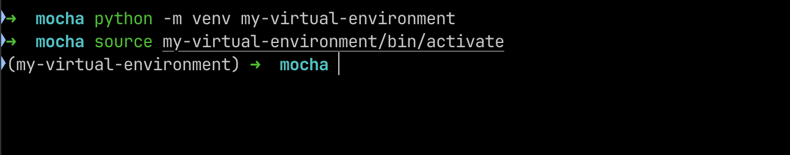

## Chapter 2: Project, app, wsgi, asgi, and the files

### Setting up a Django Project

Its best practice to create a virtual environment to base your project off of. So lets do that first, as we are creating a todo app lets name it and create a folder for it.

```bash
mkdir mocha
```

Im calling the project mocha. After creating the project we move to the created directory.

```bash
cd mocha
```

To create a virtual environment we can excecute

```bash
python -m venv my-virtual-environment
```

This will create a virtual environment called 'my-virtual-environment` in the folder. To activate this virtual environment we run

```bash
source my-virtual-environment/bin/activate
```

once the virtual environment is active, we will see



> We don’t push the virtual environment related files to git. So its better to add a `.gitignore` to the project now

TODO: ADD `.gitignore` DOCS HERE

To deactivate the virtual environment we can just run:

```bash
deactivate
```

Once that is done we can install Django and set up our project. To install Django

```bash
pip install django
```

Once django is installed we can start a project.

```bash
django-admin startproject mocha .
```

> Note the `.` in the end? If that is missing django will enclose the app in a folder. We dont want that hence the `.` . We want it to scaffold it in the CWD(current working directory)

Now run 
```
python manage.py runserver
```

head to `localhost:8000` you'll be treated with the django starter page.

[next chapter](chapter_3.md)