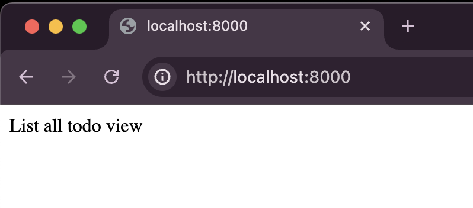
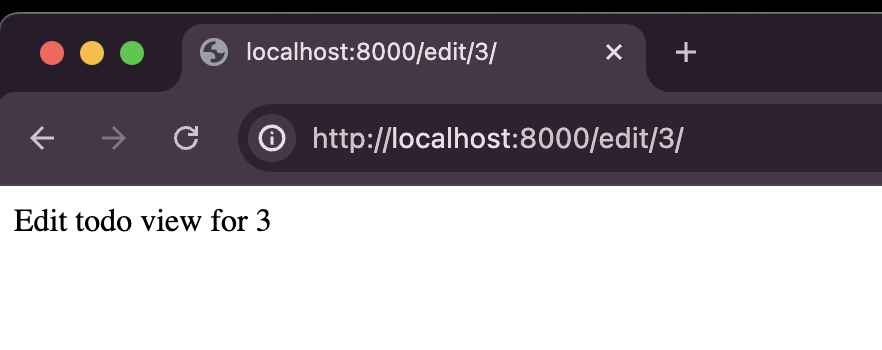

## Chapter 3: Apps, Models, DB

In the previous chapter we set up a django project called mocha and added a todo app to it. No we connect the todo app to the main project(mocha), and configure our database, deal with migrations and more.

So we created a new app called todo. To connect it to the main project we need to do a few things.

in `mocha/settings.py` (the settings file of the project) we need to add `todo` as an installed app. According to the new documentation we write `todo.apps.TodoConfig` but just `todo` will also work.

```
# Application definition

INSTALLED_APPS = [
    'django.contrib.admin',
    'django.contrib.auth',
    'django.contrib.contenttypes',
    'django.contrib.sessions',
    'django.contrib.messages',
    'django.contrib.staticfiles',
    'todo.apps.TodoConfig',
]
```

Now will be a good time to explain what the rest of these are.

- django.contrib.admin – Responsible for django admin site
- django.contrib.auth – An authentication system.
- django.contrib.contenttypes – A framework for content types.
- django.contrib.sessions – A session framework.
- django.contrib.messages – A messaging framework.
- django.contrib.staticfiles – A framework for managing static files. eg: HTML, CSS, JS

Once the todo app is added we need to add some urls to the todo app and wire it to the project's urls.

So lets create a `todo/urls.py` and add some urls

```
from django.urls import path

urlpatterns = [
    path("add/", "add todo view", name="add_todo"),  # create todo
    path("", "list all todo view", name="list_all_todo"),  # read all todo
    path("edit/<int:todo_id>/", "edit todo view", name="edit_todo"),  # update todo
    path(
        "delete/<int:todo_id>/", "delete todo view", name="delete_todo"
    ),  # delete todo
]
```

now in `todo/views.py` lets add the views for the above routes

```
from django.http import HttpResponse

# Create
def add_todo(request):
    return HttpResponse("Add todo view")

# Read
def list_all_todo(request):
    return HttpResponse("List all todo view")

# Update
def edit_todo(request, todo_id):
    return HttpResponse(f"Edit todo view for {todo_id}")

# Delete
def delete_todo(request, todo_id):
    return HttpResponse(f"Delete todo view for {todo_id}")
```

now can connect these views to the urls, in the `todo/urls.py`:

```
from django.urls import path
from . import views

urlpatterns = [
    path("add/", views.add_todo, name="add_todo"),  # create todo
    path("", views.list_all_todo, name="list_all_todo"),  # read all todo
    path("edit/<int:todo_id>/", views.edit_todo, name="edit_todo"),  # update todo
    path("delete/<int:todo_id>/", views.delete_todo, name="delete_todo"),  # delete todo
]
```

lets add the app urls to the project urls. in `mocha/urls.py`:

```
from django.contrib import admin
from django.urls import path,include

urlpatterns = [
    path('admin/', admin.site.urls),
    path('', include('todo.urls')),
]
```

When we visit `localhost:8000` we get


> Logic explained: "" indicate we are defining a root route, including an app url at "" means we need the urls from that app to be appended to '/'

> eg: `localhost:8000/edit/3/` will show `Edit todo view for 3`



TODO: Provide better example


